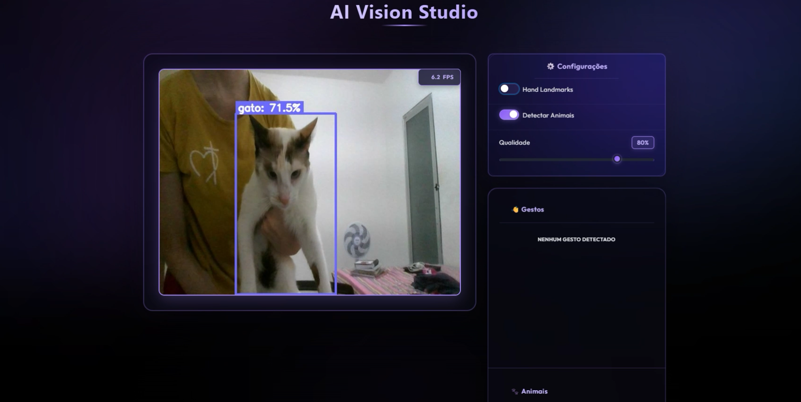
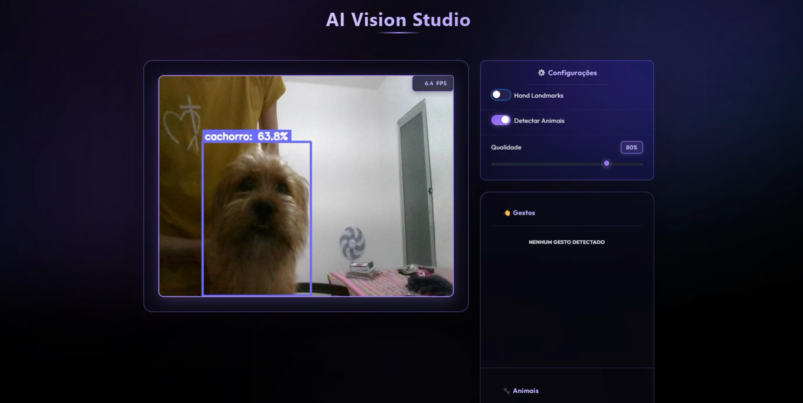

# 🖐️ IA Vision Studio | NLW Operator (Trilha Python)

O **IA Vision Studio** é uma plataforma de visão computacional em tempo real que une o poder do **Python** com modelos avançados de Deep Learning. Este projeto foi desenvolvido durante a trilha Python do evento **NLW Operator** da Rocketseat, explorando o potencial de fluxos inteligentes, automação e arquitetura de IA.

---

## 📸 Galeria do Projeto
*(Espaço reservado para os prints da aplicação)*

### Interface de Controle (FastHTML)


### Reconhecimento de Gestos e Sinais
[Espaço para o print 1]

### 🐾 Detecção de Animais (YOLOv8)
Exemplos do modelo identificando animais no ambiente:




---

## ⚡ Desenvolvimento Low Code & IA Assistida

Este projeto foi construído utilizando uma abordagem moderna de desenvolvimento acelerado por Inteligência Artificial, focada em produtividade e resolução de problemas complexos:

* **Prompt Engineering:** Uso estratégico do **Gemini** e **Claude** para arquitetura de código, lógica de negócio e correção de bugs.
* **Antigravity:** Utilização do ambiente Antigravity para prototipagem rápida e testes de fluxos.
* **VS Code:** Ambiente de desenvolvimento principal para refinamento, integração de sistemas e versionamento.

---

## 🚀 Deploy & Infraestrutura (Hugging Face)

Um dos grandes marcos deste projeto foi o **Deploy no Hugging Face Spaces**. O aplicativo está rodando em um container **Docker**, garantindo que todas as dependências funcionem perfeitamente na nuvem.

* **Ambiente:** Hugging Face Spaces (SDK Docker)
* **Acesse o projeto ao vivo:** 👉 [IA Vision Studio no Hugging Face](https://huggingface.co/spaces/Tissiany/AI-Vision-Studio)

---

## 🧠 Funcionalidades Principais

* **Reconhecimento de Gestos:** Identificação precisa de sinais utilizando **MediaPipe** e um classificador customizado treinado via **Scikit-Learn**.
* **Detecção de Objetos:** Implementação do modelo **YOLOv8** (Ultralytics) para rastreamento de elementos em tempo real.
* **Interface Interativa:** Painel dinâmico desenvolvido com **FastHTML** e **JavaScript** que permite ativar/desativar camadas de IA.

---

## 🛠️ Tecnologias e Ferramentas

* **Linguagem:** Python 3.11
* **Visão Computacional:** OpenCV, MediaPipe, Ultralytics (YOLOv8)
* **Machine Learning:** Scikit-Learn, Joblib
* **Web Framework:** FastHTML
* **Infraestrutura:** Docker, Hugging Face Spaces

---

## ⚠️ Dicas de Performance e Uso

Durante o desenvolvimento, notei que o processamento simultâneo de múltiplos modelos pode sobrecarregar a CPU.

* **Melhorar a Webcam:** Para garantir uma taxa de quadros (FPS) mais fluida e reduzir o atraso (lag) na webcam, **recomenda-se desativar a detecção de animais/objetos** quando o foco for apenas o reconhecimento de gestos.
* **Uso Seletivo:** Ative apenas um modelo por vez no painel lateral para obter a melhor resposta em tempo real.

---

## 💻 Como Rodar Localmente

1.  **Clone o repositório:**
    ```bash
    git clone [https://github.com/tissiany-delmiro/ia-vision-studio.git](https://github.com/tissiany-delmiro/ia-vision-studio.git)
    ```

2.  **Entre na pasta e crie o ambiente virtual:**
    ```bash
    cd ia-vision-studio
    python -m venv .venv
    # Ative (.venv\Scripts\activate no Windows ou source .venv/bin/activate no Linux)
    ```

3.  **Instale as dependências e rode:**
    ```bash
    pip install -r requirements.txt
    python app.py
    ```

---

## 📝 Licença

Desenvolvido para fins educacionais durante o NLW Operador. Sinta-se à vontade para explorar!
